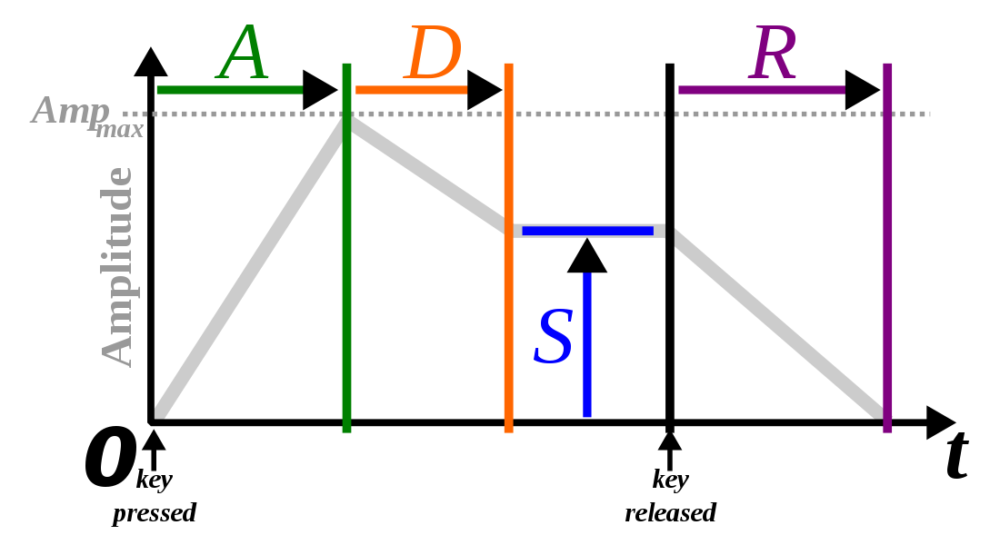

Title:       LRU Queues for Allocating MIDI Note On Events to Synthesizer Channels
Author:      Joe Bergeron
Date:        June 20, 2018
PostNum:     4

# LRU Queues for Allocating MIDI Note On Events to Synthesizer Channels
  

A few weeks ago, I graduated (hooray) from the school I've been attending for the past four years of my life. I start working full time in August, but until then, I have two months of complete, unsupervised freedom. In an effort to not go absolutley insane, I've tried to occupy my time with various projects. The largest of these projects is a pretty involved and "feature-rich" synthesizer based off the oldschool [YM2612](https://en.wikipedia.org/wiki/Yamaha_YM2612) chip -- a 6 channel, 4 operator FM synth IC produced by Yamaha and used in a number of consumer products like the [Sega Mega Drive](https://en.wikipedia.org/wiki/Sega_Genesis).

Among the list of synth features I want is MIDI control. [MIDI](https://en.wikipedia.org/wiki/MIDI) is general protocol for the communication of musical information between electronic musical instruments, music sequencing software, or whatever else you want. MIDI data is transmitted serially as a sequence of byte values, which represent either **command** or **data** bytes. Each command byte is followed by some number of data bytes, and together, they make up a MIDI message. Most MIDI messages specify *real-time* events. That is to say, most MIDI messages are expected to be interpreted by the receiving device the instant they are received. In this way, MIDI can be used to control a synthesizer or other device in real time, by sending Note On or Note Off messages from a MIDI enabled keyboard, or more interestingly, a program which allows you to sequence MIDI data.

For example, when you press a key on a MIDI-enabled keyboard, the keyboard sends a MIDI "Note On" message out of its MIDI port, which contains both the note to play, and the velocity, or volume, at which to play the note, both of which are represented by a byte a piece. As soon as the MIDI-compliant receiving device reads in this data, it's expected to interpret it immediately; this almost always means playing the note at the desired velocity. Likewise, when a note is released on a MIDI keyboard, the keyboard sends a MIDI "Note Off" message, which the recieving device responds to by, well, turning the desired note off. All of these MIDI parsing semantics must be implemented by the designer of the receiving device -- in my case, a synth.

The YM2612 that I'm centering my synthesizer around contains 6 channels. Each channel can play a single note at once. This means that when my synthesizer receives a MIDI Note On message, it must allocate a channel to play the requested note. If the synthesizer recieves a Note On message while all the channels have notes playing, there must be some sort of rule to decide what happens. Likewise, when the synthesizer recieves a Note Off message, it must tell whatever channel is currently playing that note to *release* that note. Conceivably, if the synth receives a Note Off command for a note that's not playing on any channel, then nothing should happen.

This procedure of allocating notes to channels is more or less how all polyphonic synthesizers play notes. Given that many synthesizers are limited on how many voices can sound at once, it's important to have a relatively intelligent protocol for allocating notes to channels, such that all the channels are used to their fullest. While working on my synthesizer, I realized that this was an important design consideration pretty early on, and figured someone had already figured this out. After a good amount of Googling, I wasn't able to find any information on the topic of allocating voices to channels in synthesizers. I figured it couldn't be that hard, so I set out to solve the problem myself.

## A First Attempt

Before getting into my first naive solution to this problem, let's first look at a silly little toy synthesizer class definition so we have something to build on. My synthesizer is controlled by a beefy little embedded AVR chip programmed in C++, so that's what we'll be using here.

	:::c++

	#define NUM_CHANNELS 6

	class Synth {
		private:
			void noteOn(uint8_t note, uint8_t velocity, uint8_t channel);
			void noteOff(uint8_t channel);

			uint8_t noteArray[NUM_CHANNELS];
		public:
			Synth();
			void midiNoteOn(uint8_t note, uint8_t velocity);
			void midiNoteOff(uint8_t note);
			void parseMidiMessage(MIDIMessage *msg);
	}

This representation is oversimplifying things, but it exposes all the things we're concerned with for our problem. The private method `noteOn` triggers a note to play at a given volume at a given channel, and `noteOff` tells a given synthesizer channel to release whatever note it's playing. The public method `midiNoteOn` takes a note and velocity from a MIDI Note On message and triggers a note to play on some channel. `midiNoteOff` takes a note value from a MIDI message and sends a note off command to whatever channel that note might have been playing on. Both `midiNoteOn` and `midiNoteOff` trigger or release notes by calling the private `noteOn` and `noteOff`. Our goal will be to fill in the bodies of these two functions, implementing some way of allocating notes to channels, and eventually releasing those notes.

It's not really necessary here, but `parseMidiMessage` takes in a MIDIMessage object which presumably contains a MIDI message and its parameters, and interprets it, by dispatching to various MIDI handling functions. That is, `parseMidiMessage` would dispatch a MIDI Note On message to `midiNoteOn`, and so on. This is similar to how I implemented MIDI handling in my own synth.

The private array `noteArray` is how I chose to implement the first version of my note/channel allocation. The array has as many elements as there are channels in the synthesizer, and is zero-initialized. Index `i` then corresponds to channel `i`. A value of 0 in some index `i` means that there is *no note* being played on channel `i`. More specifically, it means that *the most recent command to given to that channel was a note off command*, and *not* a note on command. A nonzero value `n` in some index `i` means that channel `i` is currently playing note `n`, or that the most recent command given to channel `i` was a note on command, with note value `n`. For the first iteration of my allocation scheme, this is all the bookkeeping that was required.

Now that we have the necessary framework in place, we can jump into my first naive approach.

	:::c++

	void Synth::midiNoteOn(uint8_t note, uint8_t velocity) {
		// If we're already playing the given note, retrigger it on the same channel
		for (int i = 0; i < NUM_CHANNELS; i++) {
			if (noteArray[i] == note) {
				noteOn(note, velocity, i);
				return;
			}
		}
		// Otherwise, find an empty channel to play it on
		for (int i = 0; i < NUM_CHANNELS; i++) {
			if (noteArray[i] == 0) {
				noteArray[i] = note;
				noteOn(note, velocity, i);
				return;
			}
		}
		return;
	}

	void Synth::midiNoteOff(uint8_t note) {
		for (int i = 0; i < NUM_CHANNELS; i++) {
			if (noteArray[i] == note){
				noteArray[i] = 0;
				noteOff(i);
				return;
			}
		}
		return;
	}

Pretty simple. The idea here is that when we get a note on command, we iterate through noteArray and trigger a note on the first channel that we find that isn't playing a note. If all channels are playing notes, nothing happens. If we get a note on command for a note that's already playing on some channel, we just retrigger the note on that channel. If we try to turn a note off that isn't being played anywhere, nothing happens. This all seems pretty intuitive and straightforward.

(The astute reader might notice that using this protocol, `midiNoteOff` is inneficient in that we have to iterate through the entirety of `noteArray` giving us O(`NUM_CHANNELS`). We could use a hash map like `std::unordered_map`, mapping note values to channels, in order to get O(1) performance, but I don't have the C++ standard library easily available to me on my embedded platform, and I had no intention of implementing hash tables, so whatever.)

After flashing my microcontroller with this code and plugging in a MIDI keyboard to control my synth, everything sounded *mostly* right. I was indeed getting six-voice polyphony, in that if I held several notes down at once (up to six), they would all play at once, and if I released them, the synthesizer would release the notes as well. After noodling around on my keyboard for a bit though, I noticed some strange behavior that I hadn't accounted for.

The vast majority of synthesizers share a common way of determining note volume (amplitude) over time. By specifying an [ADSR envelope](https://en.wikipedia.org/wiki/Synthesizer#Attack_Decay_Sustain_Release_\(ADSR\)_envelope), one can shape the volume of the note over time. "ADSR" stands for **attack**, **decay**, **sustain**, and **release**. When a note is triggered, it takes a certain amount of time to reach its peak amplitude, before decaying to a constant amplitude at which it's sustained. When the note is released, its amplitude goes towards 0 after a set length of time. An ADSR envelope allows the user to parametrize these values, in order to craft different types of sounds.

  
</img>

*A typical ADSR envelope. "A", "D", and "R" are all variables of time, and "S" represents an amplitude value. (Source: [Wikipedia](https://en.wikipedia.org/wiki/Synthesizer#/media/File:ADSR_parameter.svg))*

  

What's relevant to us here, is that *a note continues to sound even after it's been released*. Calling `noteOff` for some channel in our synth does *not* necessarily mean that the channel instantly stops producing sound (unless, of course, the release time is instantaneous). Consider, then, what this means for our synthesizer.

Using the scheme discussed above, when I pressed a single note on my keyboard and released it, the note was triggered and subsequently entered the "release" portion of the ADSR when I lifted my finger. However, when I pressed and released one note and then immediately pressed a diferent note, the "release" tail of the first note was cut off -- a behvaior that's expected of monophonic synthesizers, but not polyphonic ones.

This behavior makes sense, though. When no notes are being played, `noteArray` is filled with zeros. Pressing the first key will trigger a note on channel 0 of the synthesizer, and `noteArray[0]` will be occupied with a note value. When we release the note, `noteArray[0]` is set to 0 once again, and the ADSR enters the release phase. When the second note is pressed down, it's *also* triggered on channel 0, which overrides the release of the previous note that was pressed. Clearly, in this scenario, the second note should have been triggered on a different channel. But which one?

## Least Recently Used (LRU) Queues

Consider the case where we're playing a few notes and a few others have just been released. If we press a new note (without releasing those notes we're currently playing), what channel should we play it on? Clearly, we want to play it on a channel where a note is being released rather than one where a note is currently playing. Since all the channels that are playing released notes could still be generating sound, we want to pick the channel which has the least chance of interrupting a note whose release is sounding. Ultimately, this is the channel which was released *longest ago* out of all released channels. In other words, the **least recently used** channel which is sounding a released note. (The idea of keeping track of the "least recently used" object is probably most well known as a [cache replacement policy](https://en.wikipedia.org/wiki/Cache_replacement_policies#Least_recently_used_\(LRU\)), which evicts members of cache lines based on their time of access.)

Our note-to-channel allocation scheme, then, should somehow incorporate the concept of least recently used channels when picking what channel to play notes on. Before we go on, though, let's formalize a few things.

* We call a channel **busy** if it has been issued a "note on" command, but not yet a "note off" command -- the most recent command issued to the channel was a "note on".

* We call a channel **free** if it has been issued a "note on" command followed by a "note off" command -- the most recent command issued to the channel was a "note off".

Now, imagine maintaining a list of all the busy channels and all the free channels, each sorted by their time of access, *descending*. Now, if we want to play a note and the list of free channels is non-empty, what channel should we play it on? We can simply take the first channel in the free list and play it on that channel. But now that the channel is no longer free, we have to remove it form the free list and add it to the busy list. Since this channel is now the *most recent* busy channel, we place it at the very end of the busy list.

Pretty simple, right? You may have already noticed, however, that we're using the free and busy lists in a particular way, more amenable to a more particular data structure than a simple list or array. (You may also have seen the title of this section.) We can use **queues** instead of lists, where popping a value off a queue returns the least recently used value in the queue. We can do this in a few ways. We could use a *priority queue*, where each channel is keyed by its access timestamp, and popping a value pops the value with the smallest timestamp. I don't really want to mess around with timsetamps, though. If we follow a simple protocol for pushing and popping channels on to and off of these queues, we can guarantee that a pop will always return the least recently used busy or free channel.

Unfortunately, I didn't have access to any sort of data type implementing queues, so I whipped one up myself. Brings me back to my intro CS classes from a billion years ago. Of course, we need a way to push and pop on and off the queue, and a way to check if the queue is empty is probably also useful. For reasons we'll see soon, we also need a way to *remove* a given element from the queue (if it exists in the queue), moving ahead all elements that were behind. That leads us to a class definition like below.

	:::c++
	#define MAX_QUEUE_SIZE NUM_CHANNELS
	class IntQueue {
		private:
			int itemsInQueue;
			int queueArray[MAX_QUEUE_SIZE];
		public:
			IntQueue();
			// Pushes an item into the back of the queue. Returns true if successful
			bool push(int val);
			// Puts the first element of the queue in the given pointer. If there are no elements
			// in the queue, returns false
			bool pop(int *valPtr);
			// Searches the queue for val, and deletes the first instance found
			bool remove(int val);
			// True if queue is empty
			bool isEmpty();
	}

We implement the queue with a simple array and a value to keep track how many elements are currently in the queue. `pop` might seem strange in that it doesn't return the value its popping -- it fills a pointer with the value, and returns `true` if the pop was successful, since we don't fill the pointer if the queue is empty.

	:::c++
	IntQueue::IntQueue() {
		itemsInQueue = 0;
	}

	bool IntQueue::push(int val) {
		if (itemsInQueue < MAX_QUEUE_SIZE) {
			queueArray[itemsInQueue] = val;
			itemsInQueue++;
			return true;
		}
		return false;
	}

	bool IntQueue::pop(int *valPtr) {
		if (itemsInQueue == 0)
			return false;
		int val = queueArray[0];
		for (int i = 0; i < MAX_QUEUE_SIZE - 1; i++) {
			queueArray[i] = queueArray[i+1];
		}
		*valPtr = val;
		itemsInQueue--;
		return true;
	}

	bool intQueue::remove(int val) {
		for (int i = 0; i < itemsInQueue; i++) {
			if (queueArray[i] == val) {
				int index = i;
				for (int j = index; j < itmesInQueue - 1; j++) {
					queueArray[j] = queueArray[j+1];
				}
				itemsInQueue--;
				return true;
			}
		}
		return false;
	}

	bool intQueue::isEmpty() {
		return itemsInQueue == 0;
	}

Pretty standard stuff here. The `remove` method searches for an instance of the given value and then removes it by bubbling all elements behind it in the queue foward. Other than that, this is all pretty boring. With our queue data structure in place though, we can get on to nailing down our final implementation.

## A Better Solution

First, let's update our synthesizer representation a little bit. We discussed maintining lists (or queues) to kepp track of the least recently used busy and free channels, so let's add those in. We *still* need to keep track of what notes are playing on busy channels, so we keep our `noteArray` in there.

	:::c++

	#define NUM_CHANNELS 6

	class Synth {
		private:
			void noteOn(uint8_t note, uint8_t velocity, uint8_t channel);
			void noteOff(uint8_t channel);

			uint8_t noteArray[NUM_CHANNELS];
			IntQueue lruFreeQueue;
			IntQueue lruBusyQueue;
		public:
			Synth();
			void midiNoteOn(uint8_t note, uint8_t velocity);
			void midiNoteOff(uint8_t note);
			void parseMidiMessage(MIDIMessage *msg);
	}

Nice. We didn't really have to do anything in our previous `Synth` constructor (except maybe zero our `noteArray`), but we have to think a little bit for this new one. What do we want to initialize our queues to? Well, when we turn the synth on, every channel is free, so, just throw every channel in the free queue.

	:::c++

	Synth::Synth() : lruFreeQueue(), lruBusyQueue() {
		for (int i = 0; i < NUM_CHANNELS; i++) {
			noteArray[i] = 0;
			lruFreeQueue.push(i);
		}
	}

Simple. Now all we have to do is fill in the function bodies for `midiNoteOn` and `midiNoteOff`. We'll devise a simple protocol for moving channels between the busy and free queues such that at any given time, we *always have the guaruntee* that between both queues, each channel appears exactly once.

Now, here's an overview of how we handle note on requests.

1. If some channel (necessarily a *busy* channel) is already playing the requested note, retrigger the note on that channel, and move that channel to the back of the busy queue.

2. Else, if there are any free channels, trigger the note on the least recently used free channel, and move that channel to the back of the busy queue.

3. Otherwise, there are no free channels, so trigger the note on the least recently used *busy* channel, and move that channel to the back of the busy queue.

4. Whenever a note is turned on on a particular channel, set that channel's value in `noteArray` to whatever note was just triggered, so we know what channel to send a note off command to later.

Relatively straightforward. Let's jump straight into the codified version of this.

	:::c++
	void Synth::midiNoteOn(uint8_t note, uint8_t velocity) {
		int channel = 0;
		// First check if any channel is currently playing the note
		for (int i = 0; i < NUM_CHANNELS; i++) {
			if (noteArray[i] == note) {
				// Case 1
				channel = i;
				lruBusyQueue.remove(channel);
				lruBusyQueue.push(channel);
				noteArray[channel] = note;
				noteOn(note, velocity, channel);
				return;
			}
		}
		// If the free queue isn't empty, then we have an available channel. Play the note on the LRU one.
		if (!lruFreeQueue.isEmpty()) {
			// Case 2
			lruFreeQueue.pop(&channel);
			lruBusyQueue.push(channel);
			noteArray[channel] = note;
			noteOn(note, velocity, channel);
			return;
		} else { // Otherwise, there are no free channels, so they're all in the busy queue.
			// Case 3
			lruBusyQueue.pop(&channel);
			lruBusyQueue.push(channel);
			noteArray[channel] = note;
			noteOn(note, velocity, channel);
		}
		return;
	}

Observe that our first case relies on the assumption that the channel that's playing the requested note *is* in fact in the busy queue. This assumption is guaranteed by our scheme though. If a note is triggered on some channel, the channel will necessarily be added to the busy queue and its value in `noteArray` will be updated. Our protocol for turning notes off holds up the other end of the bargain, by ensuring that when the note requested to be turned off exists in `notesArray`, we zero that index and remove the associated channel from the busy queue.

As a brief aside, you've probably noticed that this protocol doesn't allow the same note to be played simaltaneously on multiple channels. Our synthesizer definitely supports this behavior, but supporting this in software seems unnecessary. For one, this situation would almost never naturally occur, *regardless* of the device controlling the synthesizer, be it a keyboard played by someone in real time or a software [DAW](google.com). Secondly, allowing this behavior requires us to make some difficult technical decisions. Imagine we sent the synth multiple note on requests for the same note, so the same note was sounding on all the channels. If we send a note off request for that note, what happens? Turning all the channels off doesn't seem useful, nor does picking one randomly. Maybe turning off the channel that least recently turned that note on? This would require some version of having an LRU queue on a *note* basis, not just a channel basis. Yuck. Anyways, you can see why I only let one copy of a note sound at once.

Let's look at our updated version of `midiNoteOff`, which is way simpler than its counterpart.

	:::c++

	void Synth::midiNoteOff(uint8_t note) {
		for (int i = 0; i < NUM_CHANNELS; i++) {
			lruBusyQueue.remove(i);
			lruFreeQueue.push(i);
			noteArray[i] = 0;
			noteOff(i);
			return;
		}
	}

A lot simpler, right? We just iterate through all the channels, and if one is playing the requested note, we shut it off by removing it from the busy queue and marking it as once again free by pushing it to the back of the free queue. Case 1 from `midiNoteOn` makes sure that if we see some note in `noteArray`, we can be sure it only occurs once, so `midiNoteOff` only has to look until it finds a single channel playing the requested note.

And that's about it. To be completely honest, I haven't had a chance to test this out yet since I'm out of town and don't have access to my synth, but I'm **99%** sure that it will work (hah). It's a pretty simple solution, and this blog post is probably about 5x longer than it needed to be, but hopefully this information can help some lone synth builder out. 
