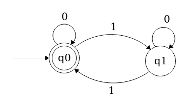

Title: Determinstic Finite Automata in Go
Author: Joe Bergeron
Date: December 28, 2016
PostNum: 3

# Determinstic Finite Automata in Go
  
<i> I wrote this post a few years back with the intention of covering DFAs, PDAs, and Turing Machines. Clearly, I never got that far, but thought it might be interesting or useful to some people even if it just covered DFAs. This was supposed to be a blog post to go along with a Go package I was working on called [gocompute](https://github.com/Jophish/gocompute), which was meant to contain a bunch of tools for messing around wth computability theory (and have a full test suite). I only ever implemented DFAs (and some cool DFA composition stuff), but feel free to make a PR ;).
</i>
  

A few semesters ago, I took MIT's [18.404 - Introduction to the Theory of Computation](https://ocw.mit.edu/courses/mathematics/18-404j-theory-of-computation-fall-2006/) taught by Michael Sipser. Sipser is an  incredibly good lecturer (my evaluation having regrettably skipped a number of his lectures), and teaches a super interesting class, basically covering the foundations of computability & complexity theory. What's this post about, then? Ostensibly, a tiny exploration into these topics, through the lens of implementing some tools of computability theory in Go.

*Roughly*, computability theory addresses the question of *"what is computable?"*, where complexity theory asks, given a problem, *"what resources are needed to compute this?"*. This is a pretty high level, handwavy description of two incredibly deep fields, but it's enough to give a good picture. We're going to be focusing mainly on (very basic) computability theory here. A good starting place might be defining what exactly the word "computable" means.

A [**decision problem**](https://en.wikipedia.org/wiki/Decision_problem) is a question whose answer is *yes* or *no*. Let's call a **language** $A$ a set of strings over an **alphabet** $\Sigma$, which is a finite set of symbols, and some rules by which strings in the language must abide. For example, the language $A$ of all strings over the alphabet $\Sigma = \{0,1\}$ of the form $0^k1^k$ is (in [set-builder notation](https://en.wikipedia.org/wiki/Set-builder_notation)) the set $A = \{0^k1^k | k \geq 0\}$. Note that setting $k = 0$ yields a valid, but empty, string in the language. This is a relatively common occurence, and we denote this string with $\epsilon$, the **empty string**, which is apparently present in our language $A$. The concept might be counter-intuitive at first, but compare it to *'\0'* in C or *""* in Python.

Now, given a language $A$ and a string $w$, we can formulate the desicion problem: "Is $w$ in the language $A$"? In our language $A$ above, for example, the answer is clearly *yes* for the string $000111$, and *no* for $011$. Given a string and a language we want to test its membership in, wouldn't it be nice if there were some easy way to do so? Let's introduce our first model of computation, **deterministic finite automata**, or DFAs, which are able to test string membership in a class of languages known as **regular languages**.

## Deterministic Finite Automata

A [deterministic finite automaton](https://en.wikipedia.org/wiki/Deterministic_finite_automaton), intuitively, is a collection of states and transitions between them. One state is deemed the **start state**, and others are **accept states**. Beginning in the start state, one moves from state to state along the transitions, which are determined by the current symbol being read off the input string. If, when the input string is done being read, the DFA is in an accept state, we accept the input string, and say the DFA **recognizes** the string. If the DFA ends in a *non*-accept state, we say the DFA **rejects** the string. A picture says a thousand words, so I recommend you follow the above link to the Wikipedia entry and take a look. We say a DFA **recognizes language $A$** if for every $w \in A$, the DFA recognizes $w$. The set of strings recognized by a DFA $D$ is written $L(D)$, and is called the **language** of $D$. We call a language $A$ **regular** if there exists some DFA $D$ such that $L(D) = A$.

Now, if we have some language $A$ and some DFA $D$ such that $L(D) = A$, we can use the DFA to answer our desicion problem of whether or not some arbitrary finite string is in the language $A$, since the $D$ *only* recognizes those strings in $A$. Before we try to whip up some code that simulates the action of a DFA, we need a more formal model of exactly how a DFA works.

Formally, a DFA $D$ is a 5-tuple $(Q, \Sigma, \delta, q_0, F)$, where

- $Q$ is the finite set of states
- $\Sigma$ is the finite set of input symbols, the alphabet
- $\delta: Q \times \Sigma \to Q$, the transition function
- $q_0 \in Q$ the start state
- $F \subseteq Q$, the set of accept states

We say that $D$ accepts a string $w = w_1 w_2 \dots w_n$ over $\Sigma$ if there exists a sequence of states in $Q$, $r_0,r_1\dots,r_n$ such that

- $r_0 = q_0$
- $\delta(r_i, w_{i+1}) = r_{i+1}$ $\forall$ $ 0 \leq i \leq n-1$
- $r_n \in F$

Hopefully you enjoyed me parroting Wikipedia. The formal 5-tuple definition of a DFA should make some intuitive sense. The definition of how a DFA accepts a string should also make sense - a string is accepted only if the sequence of states generated by following the transition function ends with an accept state.

Now, let's think about how we could implement this. Everything is relatively straightforward, except for implementing the transition function. There are a bunch of options, but at the end of the day, the user still has to specify $|Q||\Sigma|$ transitions, which is kind of a pain. To simplify things, we assume that the states of a DFA are labeled by strings, and the alphabet consists of strings. Then, we represent a DFA as a struct with fields of type [set](https://github.com/fatih/set) (click through for implementation) for the set of states, alphabet, and accept states; the start state is represented by a string. As for the transition function, we opt to use a *map of maps*, or more specifically, a map of states to a map of alphabet symbols to states. For a given state $q$ and alphabet symbol $a$, we can calculate the transition function of the two by looking at $transition[q][a]$. Here's the struct.

	:::go
	type DFA struct {
		states     *set.Set
		alphabet   *set.Set
		transition map[string](map[string]string)
		start      string
		accept     *set.Set
	}

Right now, all we need to do is implement some sort of constructor which can verify some necessary preconditions for the struct (accept is a subset of states, start is in states, transition has a map for every state with an entry for every alphabet symbol...), and a function which, given a string, simulates a DFA on that string and returns a bool for accept/reject.

As far as the constructor goes, we'll leave checking the preconditions as an exercise for the reader. The skeleton for the constructor would then just be

	:::go
	func NewDFA(states,
		alphabet *set.Set,
		transition map[string](map[string]string),
		start string,
		accept *set.Set) *DFA {

	    return &DFA{states, alphabet, transition, start, accept}
	}

As for the function to simulate a given DFA on a string, all we have to do is loop over the characters in the string, setting our initial state to the start state, and iteratively update our current state based on the output of the transition function. When we're done looping through the string, if the current state is a member of the set of accept states, we accept (return true), else return false. Note also that a precondition of this function is that all the characters in the input string must be members of the input alphabet.

	:::go
	func (d DFA) Simulate(w string) bool {
		currentState := d.start
		for _, r := range w {
			currentState = d.transition[currentState][string(r)]
		}
		if d.accept.Has(currentState) {
			return true
		}
		return false
	}

To test this stuff out, copy the following into a file *dfa.go* in a folder *gocompute* in your \$GOPATH/src directory. Make sure to run

	go get gopkg.in/fatih/set.v0

to grab the necessary dependency.

	:::go
	package gocompute

	import (
		"gopkg.in/fatih/set.v0"
	)

	type DFA struct {
		states     *set.Set
		alphabet   *set.Set
		transition map[string](map[string]string)
		start      string
		accept     *set.Set
	}

	func NewDFA(states,
		alphabet *set.Set,
		transition map[string](map[string]string),
		start string,
		accept *set.Set) *DFA {

		return &DFA{states, alphabet, transition, start, accept}
	}

	func (d DFA) Simulate(w string) bool {
		currentState := d.start
		for _, r := range w {
			currentState = d.transition[currentState][string(r)]
		}
		if d.accept.Has(currentState) {
			return true
		}
		return false
	}

Now, let's test it out. Below you'll find a diagram of the DFA which recognizes the language of strings of 0s and 1s with an even number of 1s. Verify this for yourself. This one's pretty simple, but more complicated diagrams can be a headache to parse.

  
</img>

*DFA accepting strings of 0s and 1s with an even number of 1s. The state with a circle inside representps an accept state, directed edges are transitions, and the state (q0) with the arrow entering from nowhere is the start state.*

  

Initializing all the variables is simple enough. Again, only the transition function is a pain. Whip up a file called *main.go* in a subdirectory of whereever *dfa.go* is, and fill it with this bit of code.

	:::go
    package main

	import (
		"fmt"
		gocomp "gocompute"
		"gopkg.in/fatih/set.v0"
	)

	func main() {
		states := set.New("q0", "q1")
		alphabet := set.New("0", "1")
		transq0 := map[string]string{
			"0": "q0",
			"1": "q1",
		}
		transq1 := map[string]string{
			"0": "q1",
			"1": "q0",
		}
		transition := map[string](map[string]string){
			"q0": transq0,
			"q1": transq1,
		}
		start := "q0"
		accept := set.New("q0")
		d := gocomp.NewDFA(states, alphabet, transition, start, accept)
		output := d.Simulate("11") //should be true, 2 ones
		fmt.Println(output)
		output = d.Simulate("1011") //should be false, 3 ones
		fmt.Println(output)
		output = d.Simulate("10000010000110010010110") //should be true, 8 ones
		fmt.Println(output)
	}

The above just runs the simulator on some arbitrary values. Plug in whatever you like. Again, verify for yourself that the inputs (namely the transition function) correctly represents the geometry of the above diagram. If you type *go run main.go*, sure enough, you'll find that it works.

This is a pretty simple example. There are DFAs that are far more complicated, I'm just too lazy to type them up. As a note, DFAs aren't the only kind of finite automata that identify regular languages. An **NFA** is a [*nondeterministic finite automaton*](https://en.wikipedia.org/wiki/Nondeterministic_finite_automaton), which is like a DFA, but the transitions are made nondeterministically. This model of computation might seem more powerful, but NFAs in fact recognize exactly the same class of languages as DFAs. As an exercise - see if you can implement NFAs - either by representing/simulating them explicitly, or [constructing the equivalent DFA](https://en.wikipedia.org/wiki/Powerset_construction).

Finite automaton are all well and good, but there are in fact languages that they *cannot* recognize. Consider the language of strings of the form $0^k1^k$ from earlier. This language is *nonregular*, in that no DFA can recognize it. In order to recognize this language, some DFA would need a potentially unbounded amount of memory in order to remember how many zeroes it's already seen. This opens us up to a more powerful model of computation, which can recognize a superset of the regular languages, called **context-free languages**, but I'll leave that for another post.

Hopefully you got something out of this post, and if you're really interested, feel free to check out my [Github repo](https://github.com/Jophish/gocompute) which has a much more robust version of the functionality here along with some other nifty features. I haven't touched it in a while (and my Go is kind of rusty) but feel free to make a PR.

 <b>:^)</b> 

  

<!--
## Pushdown Automata

A [(nondeterministic) pushdown automaton](https://en.wikipedia.org/wiki/Pushdown_automaton) or **PDA** is essentially an automaton that has access to a stack which it can freely modify at each step. Given a current state, a PDA's transition function depends not just on the current input symbol in the string, but the *current symbol on the top of the stack*. At every transition, the PDA is free to push or pop to/from the stack, and read the top of the stack to determine how it transitions. Thus, the transition function of a PDA is determined by the current state, stack head, and current symbol on the input tape. (The term *input tape* comes from thinking of the machine reading the input string off a moving tape, with a fixed read head.) While we didn't discuss the nondeterministic version of finite automata earlier, in this section we *only* focus on the nondeterministic version of PDAS, since it turns out that the nondeterministic formulation of PDAs recognize a strictly larger set of languages than those recognized by deterministic PDAs. As mentioned earlier, these are the context-free languages, called as such since they are exactly the languages that can be generated by a [context-fee grammar](https://en.wikipedia.org/wiki/Context-free_grammar).
-->
